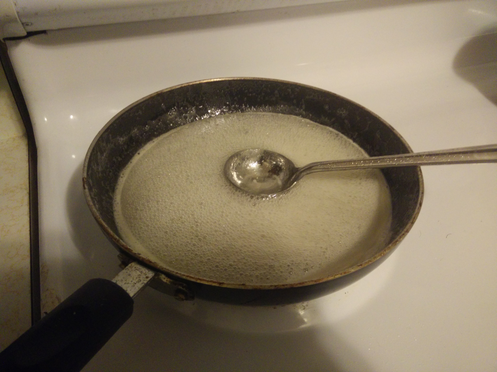

# Lemonade Concentrate 
**Source** : Grandma's Recipe

## Cooking time
NA

## Ingredients
```
[ ] Lemon(Lime) Juice - 3 oz (89 ml)
[ ] Sugar - 1 cup (16 tablespoons)
[ ] Salt (Optional)
```

## Recipe
* Cooking 
  * Mix the __sugar__ with a cup of water in a bottle
  * Shake the bottle till all the sugar dissolves.
  * (optional) Add __salt__ if you would like a sweet-and-salty lemonade.
  * Heat the solution in a vessel till boiling point. Churn the solution occasionally to prevent crystallized sugar from burning.
  * Over a period of 15-30 minutes, the solution will become thicker.
  * Now is the time to add __Lemon Juice__ which will make the consistency of the solution thinner.
  * Continue heating the solution till the solution turns slightly yellow in colour and the vessel has small droplets of concentrate on the rim.

* Storing
  * The concentrate is ready. Wait for it to cool down before you store it the refrigerator.
  * Time to refresh and beat the summer heat with a nice cold lemonade. Just mix 3 parts of iced-water with 1 part of the concentrate and you are good to go.

* Images
  *  <p align="left"> **Final Concentrate Consistency** <br> 
  </p>
